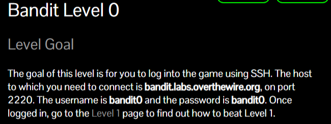
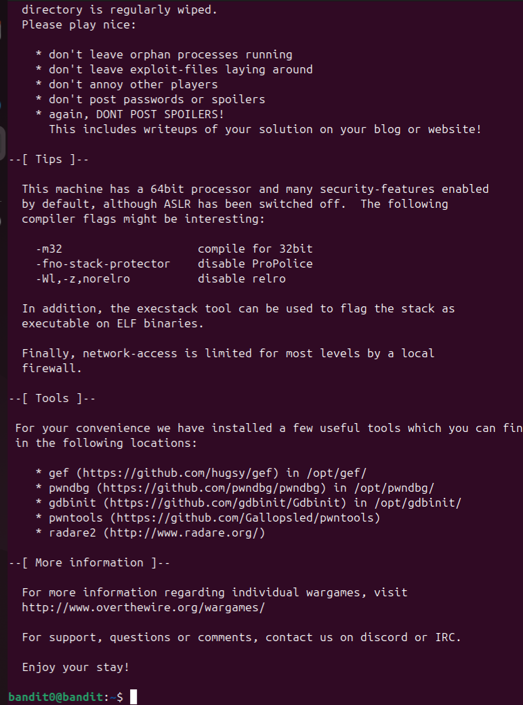

### You connect to the host bandit.labs.overthewire.org on port 2220 by using the following command:

`ssh bandit0@bandit.labs.overthewire.org -p 2220`

Then you type in the password: `bandit0`

You are now logged in, because there is a different username.

