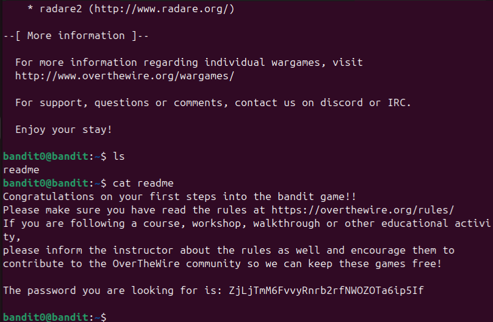
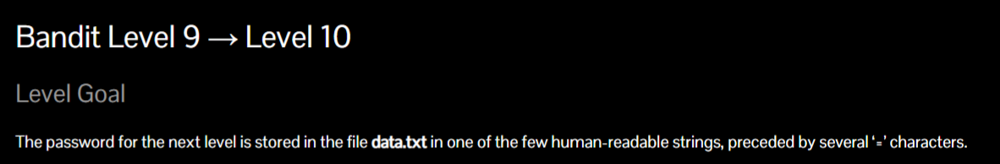
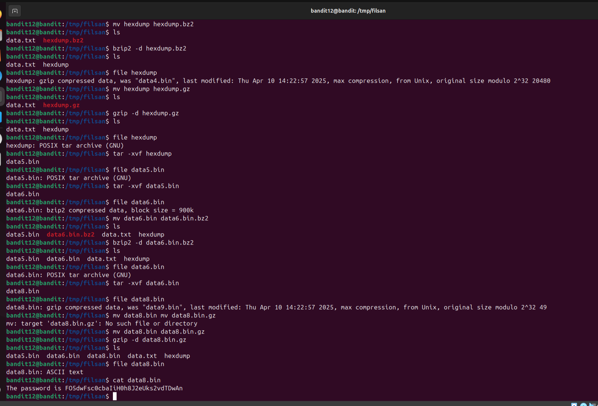

# Bandit is a game on OverTheWire.org designed to teach Linux command-line skills.

### At the end of each level, you are presented with a password, which is used to unlock the next level.

## Bandit0

## Bandit1

## Bandit2

## Bandit3

## Bandit4

## Bandit5

## Bandit6

## Bandit7

## Bandit8

## Bandit9

## Bandit10

## Bandit11

## Bandit12

## Bandit13

## Bandit14

## Bandit15

